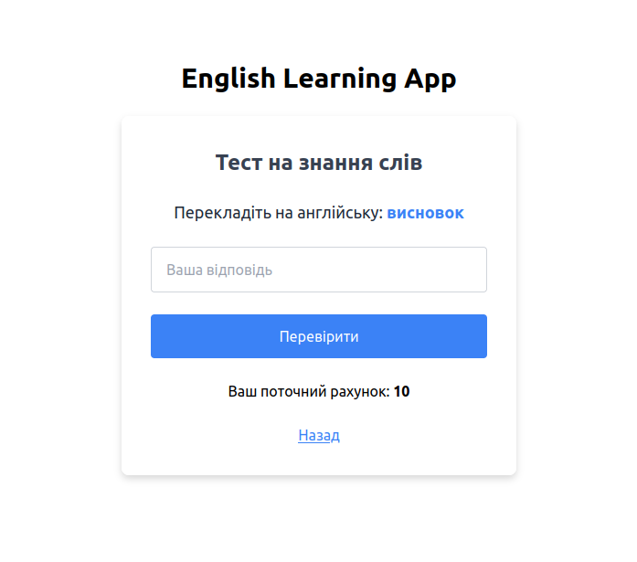

# English Learning App

### Showcase

    
    

### About project

The English Learning App is designed to help users expand their vocabulary by providing an easy-to-use interface for adding and managing English words

### How does the project work?

The English Learning App operates by leveraging the browser's localStorage to store vocabulary data

### Requirements to run the application

To start the project, you will need:

1. TypeScript >= **4.7.4**
2. Angular >= **18.2.0**

### How to run the application?

1. Clone a repository:

   `git clone https://github.com/shavlenkov/english-learning-app.git`

2. Go to the english-learning-app folder:

   `cd english-learning-app`

3. Install all dependencies using npm:

   `npm install --force`

4. Run the application for production:

   `npm start`

5. Open a browser and go to the address:
   [http://localhost:4200](http://localhost:4200 'http://localhost:4200')
